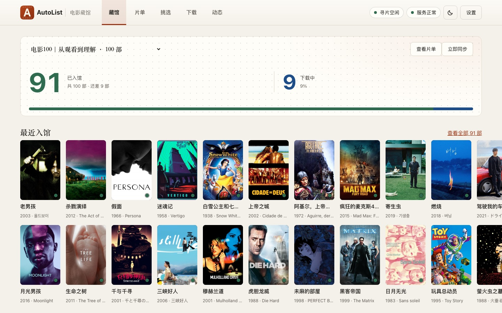
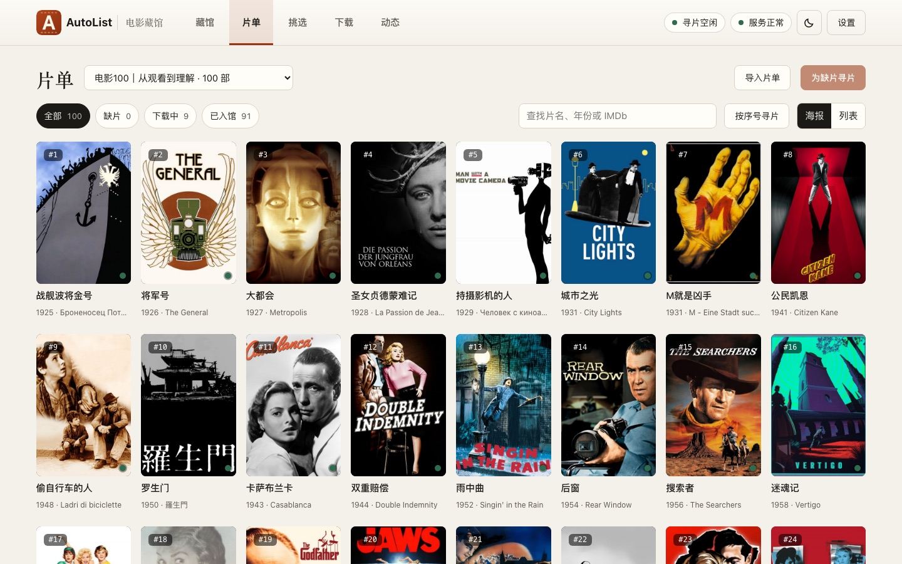
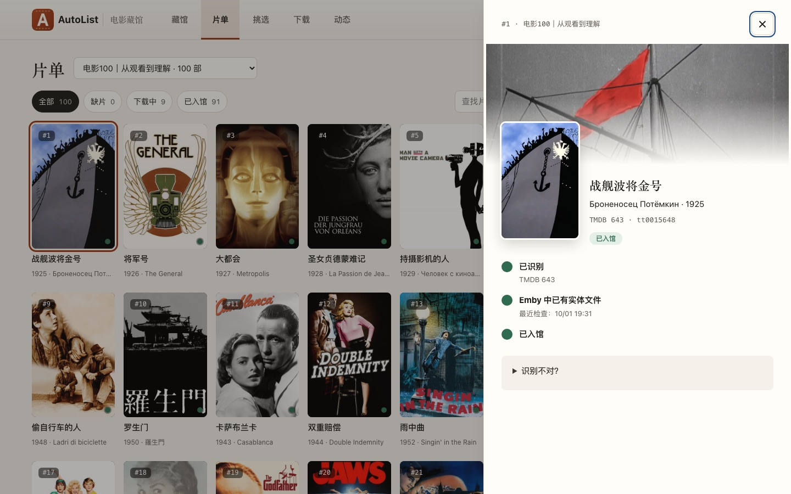

<p align="center"></p>

<h1 align="center">AutoList · 电影藏馆</h1>

[](https://github.com/CiaoBye/AutoList/actions/workflows/ci.yml)
[](LICENSE)

<p align="center"><b>给一份电影片单，自动补齐你的私人影库。</b></p>

当前版本：`2.42`

你只管维护想收藏的片单；AutoList 负责对照 Emby 找出缺哪些、去你自己的站点寻片、按你的标准挑出合格的资源，交给 MoviePilot 下载，并一直盯到影片入库。



## 为什么做它

收藏一份“经典 100 部”，手工要做的事很碎：逐部去 Emby 里确认有没有；缺的去好几个站点各搜一遍；在画质、编码、制作组各不相同的资源里挑一个；下载之后还得盯着它有没有真的整理入库；中途换了资源，又要清理旧任务。

AutoList 把这条链路收成一个以“每一部电影”为单位的工作台：**每部影片只有一个状态**（缺片、寻片中、有候选、已选定、下载中、已入馆……），该你决定的事集中放在首页，其余的交给程序。

## 它怎么工作

```
片单 ─▶ 识别(TMDB) ─▶ 对照 Emby ──已有──▶ 已入馆
                          │
                          └─缺片─▶ 在你的站点寻片 ─▶ 按入馆标准筛选 ─▶ 你来挑选
                                                                       │
              Emby 入库 ◀─ MoviePilot 整理 ◀─ Transmission ◀─ MoviePilot 提交
```

1. **导入**：TMDB 列表、Letterboxd、IMDb、MDBList，或 XLSX / CSV / JSON 文件。
2. **识别与对账**：统一识别到 TMDB；只有 Emby 里的真实媒体文件算入馆，拿不准的标“待核对”，不会误当成缺片。
3. **寻片**：用 IMDb 编号和多种片名在你添加的站点里检索，校验片名、年份与合集，跨站点的同一资源合并成一条。
4. **筛选与挑选**：按可编辑的入馆标准（分辨率、编码、制作组等）筛选，不合格的带着原因被排除，拿不准的留给你；选定后统一提交。
5. **下载与入库**：只经 MoviePilot 提交，由它分类、整理；AutoList 同步 Transmission 与 Emby 的状态，直到入库。

| 片单与状态 | 影片详情 |
| --- | --- |
|  |  |

## 特点

- **不重复、不遗漏**：提交前再核对 Emby 与 Transmission，已入馆、已在下载的相同发布会被跳过；换了资源后自动清理被取代的停滞旧任务。
- **对站点友好**：每个站点单独限速；遇到 Cookie 失效、二次验证或维护会明确提示并跳过，从不绕过验证码。可与 MoviePilot 共用 CookieCloud，Cookie 失效时自动重新拉取。
- **状态可信**：影片状态由服务端统一计算；MoviePilot、Transmission、Emby 的变化既可主动轮询，也可通过 Webhook 即时推送。
- **本地优先**：数据保存在本机 SQLite；密钥只在服务端处理，页面只显示“已配置”。
- **上手顺手**：第一次打开有分步引导；亮 / 暗两套主题，桌面与手机都能用。

AutoList 不下载、不整理文件，也不内置任何站点——站点由你自己添加（支持 NexusPHP 类站点、站点官方 API、Torznab、RSS）。

## 快速开始

需要能运行 Docker 的机器，以及：

| 服务 | 作用 | 必需 |
| --- | --- | --- |
| [TMDB](https://www.themoviedb.org/) API Key | 识别影片、取海报 | ✓ |
| [MoviePilot](https://github.com/jxxghp/MoviePilot) | 提交下载、分类、整理 | ✓ |
| 你自己的站点账号 | 寻片的来源 | ✓ |
| [Emby](https://emby.media/) | 判断是否已入库 | 建议 |
| Transmission | 读取下载状态 | 建议 |

```bash
docker compose pull
docker compose up -d
```

打开 `http://<Docker 主机>:8585`，跟着首页的引导依次连接 TMDB 与 MoviePilot、添加站点、导入片单。数据在命名卷 `autolist_data`（容器内 `/data`）；连接信息都能在“设置”页填写，也可用环境变量预填，见 `.env.example`。

> **安全提示**：AutoList 默认面向可信内网。没有设置 `AUTOLIST_ACCESS_TOKEN`、也没有反向代理鉴权时，任何能访问端口的人都能改设置并提交下载，**请不要把端口直接映射到公网**。需要远程访问时设置至少 32 位的访问令牌，或放在带鉴权的反向代理后面。

<details>
<summary>升级、备份与 CookieCloud</summary>

**升级**：`docker compose pull && docker compose up -d`。

**备份**：数据库使用 SQLite WAL，请用备份接口在线备份，不要直接复制文件：

```bash
docker exec Autolist python -c "import sqlite3; s=sqlite3.connect('/data/playlist-autodown.db'); d=sqlite3.connect('/data/playlist-autodown.db.bak'); s.backup(d); d.close()"
```

恢复时先停止容器，把当前数据库改名保留，删除它的 `-wal` / `-shm`，再把备份复制为 `playlist-autodown.db`。完整备份还应包含数据目录里的 `runtime-settings.json` 与 `candidate-context.key`。

**CookieCloud**：浏览器插件把 Cookie 推送到 MoviePilot 自带的 CookieCloud，AutoList 从同一个服务拉取。在“设置 → 站点 → Cookie 来源”填写与插件相同的地址、用户 KEY 与加密密码即可；每 10 分钟拉取一次，寻片遇到 Cookie 失效时立即补拉。

</details>

## 开发

```bash
python3 -m venv .venv && .venv/bin/pip install -r requirements.txt
cd frontend && npm ci && npm run build        # 构建到 app/static/ui
DATA_DIR=./data .venv/bin/python -m uvicorn app.main:app --host 127.0.0.1 --port 8599
```

后端 FastAPI + SQLite，前端 Preact + Vite + TypeScript。验证：`python3 -m compileall -q app`、`.venv/bin/python -m unittest discover -s tests`、`frontend` 下 `npm run build`。接口类型由后端声明生成，改动返回格式后运行 `.venv/bin/python scripts/export_openapi.py`。

协作规范见 [AGENTS.md](AGENTS.md)，领域术语见 [CONTEXT.md](CONTEXT.md)，版本记录见 [CHANGELOG.md](CHANGELOG.md)。`scripts/deploy-fnos.sh` 是作者自用的局域网部署脚本，个人参数放在不入库的 `scripts/deploy.local.env`。

## 说明

- 仅用于管理你自己合法获得的内容与账号，请遵守各站点规则。
- 本项目使用 TMDB API，但未获得 TMDB 的认可或认证；影片信息与海报来自 TMDB（可选 fanart.tv）。
- 与 MoviePilot、Emby、Transmission、TMDB 无隶属关系。

## 许可证

[MIT](LICENSE)
