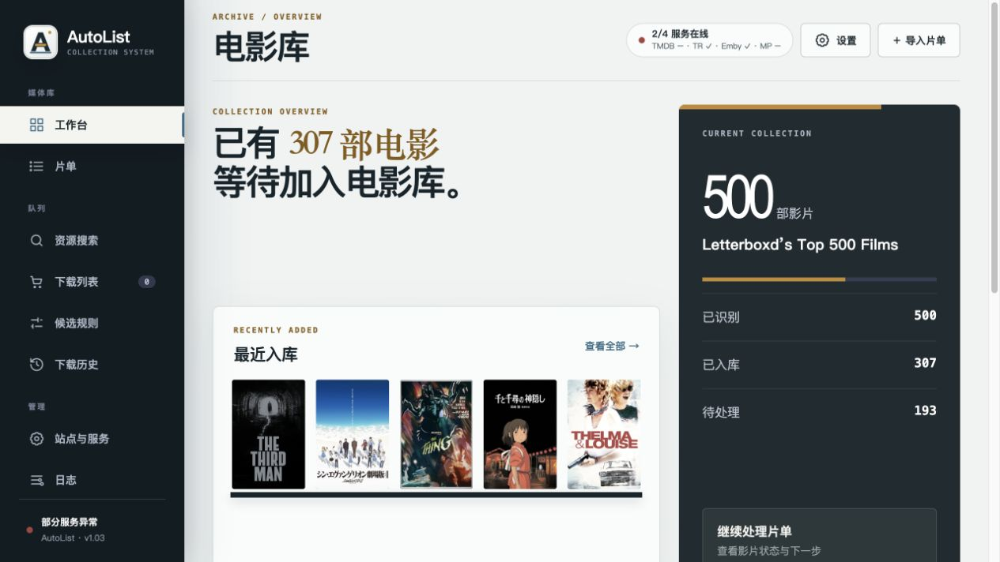
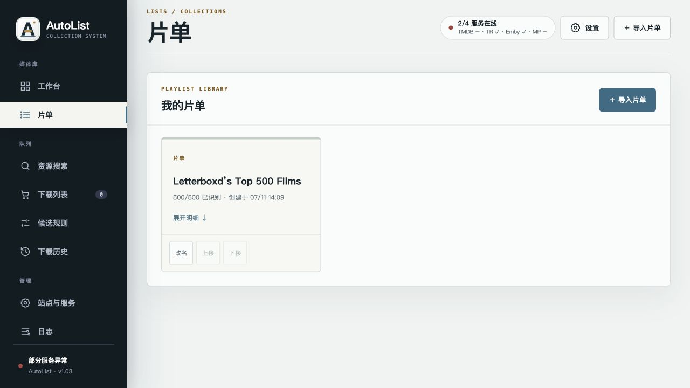
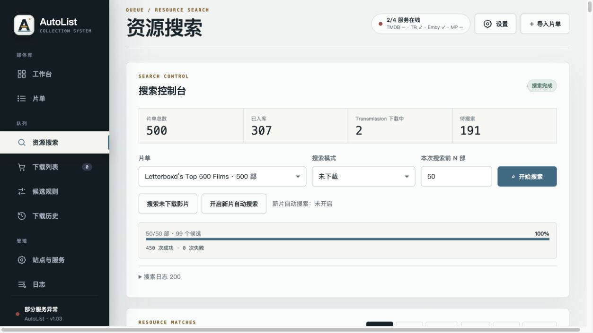
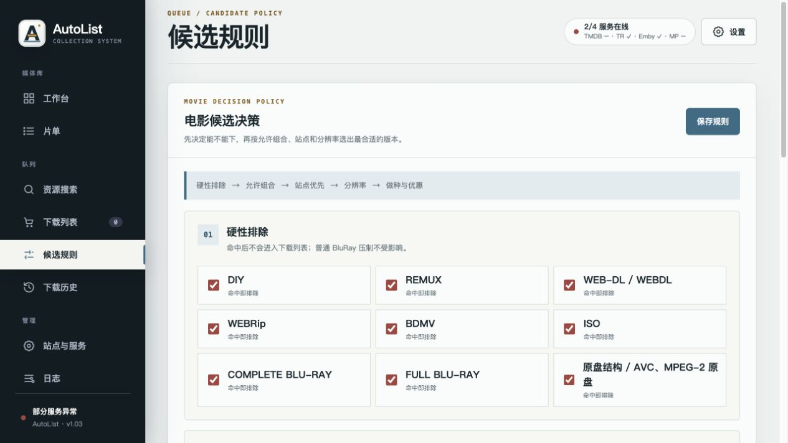
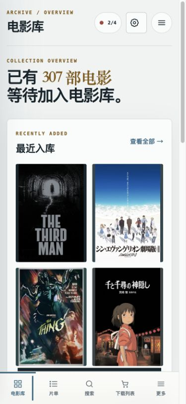

# AutoList

[](https://github.com/CiaoBye/AutoList/actions/workflows/ci.yml)

AutoList 是独立运行的片单识别、PT 搜索与下载决策服务。片单、站点、规则、候选、下载列表与历史保存在本地 SQLite；TMDB 负责影片识别，Emby 负责实体入库检查，MoviePilot 负责分类并提交 Transmission 下载。

当前版本：`1.23`。AutoList 的首页是“电影藏馆”总览：用馆藏进度、下一步任务、来源摘录和入馆动态组织全局。馆藏档案、午夜放映、编目索引是三套视觉主题预设，只改变色彩搭配与对比度；页面标题、左侧导航、正文、ARIA 文案和布局始终统一，不随主题切换产品概念。来源网络统一使用“来源档案室”语义，支持滚轮／双指缩放、空白处拖动画布、点击节点进入档案，以及独立的节点排布编辑；地图视野、排布和横向／纵向布局只保存在当前浏览器。

1.23 增加首页下一步操作入口、搜索范围与结果摘要，以及常驻来源地图／列表切换。移动端首次访问默认来源列表；显示方式保存在当前浏览器。设置支持按服务检测连接，检测使用已保存配置，修改后请先保存。

片名、年份与外部编号以 TMDB 识别结果为准；独立站点搜索会组合 IMDb、TMDB 原名、TMDB 中文名与导入原名，并在候选入库前校验高信息量片名、年份及合集标记。资源搜索默认只处理未入库且不在 Transmission 下载中的影片，可按过滤后的片单队列选择前 N 部，也可按序号范围搜索。电影候选采用硬门槛策略：只允许 `x265 + ADE/FRDS/HDS/CHD`，无首选时提供 `x264 + CMCT` 人工保底；DIY、REMUX、WEB 与完整原盘资源会明确排除。站点配置、搜索统计、CookieCloud 自动更新、User-Agent、图标代理、账户统计与制作组规则由 AutoList 独立维护；MoviePilot 只作为下载分类与整理下游。

外部片单先在导入弹窗预览再写入。TMDB 使用官方 API；Letterboxd 公开片单使用其官方嵌入页面，避免普通网页的 Cloudflare 校验；IMDb 公开 List 使用当前 GraphQL 列表接口；MDBList 公开片单使用其 JSON 接口。私有片单仍需使用站点导出文件，AutoList 不绕过验证码或登录限制。

## 实际运行效果

以下截图来自 Unraid 上实际运行的历史容器，展示真实片单数据、候选规则和响应式布局；1.18 继续完成了生产容器健康、数据完整性、Logo 资源、图标尺寸、地图交互和三套主题一致性验收。截图画廊保留为业务数据快照，公开文档不记录局域网地址；截图不包含设置页、访问令牌或其他敏感字段。

新的视觉方向原型见 [`docs/prototypes/autolist-directions.html`](docs/prototypes/autolist-directions.html)，包含站点页和电影藏馆首页的方向方案；1.18 将主题边界收敛为纯色彩预设，并修复来源网络视野、节点图标和首页信息密度。

### 主题切换

顶部“主题”菜单和“设置 → 安全与界面”都可以切换主题。主题只改变色彩搭配与对比度，不改变文字、导航、布局、片单、搜索任务、下载列表、站点配置或历史数据；选择会保存在当前浏览器本地。

- **馆藏档案 Archive**：默认主题，纸白、青绿色与黄铜色，适合长时间管理。
- **午夜放映 Cinema**：深青、冰蓝与琥珀色调，适合低亮度环境。
- **编目索引 Ledger**：米白、铁锈与深青色调，适合低饱和纸张观感。

设置内还可以关闭页面场景化或减少主题动效。关闭场景化只收敛装饰背景，不会隐藏业务信息；减少动效会同时尊重浏览器的 `prefers-reduced-motion`。

<table>
  <tr>
    <td width="50%" align="center">
      
      <br><sub>电影藏馆 · 历史桌面视图</sub>
    </td>
    <td width="50%" align="center">
      
      <br><sub>片单 · 分页与识别状态</sub>
    </td>
  </tr>
  <tr>
    <td width="50%" align="center">
      
      <br><sub>资源搜索 · 候选聚合与影片分组</sub>
    </td>
    <td width="50%" align="center">
      
      <br><sub>候选规则 · 硬性排除与优先级</sub>
    </td>
  </tr>
  <tr>
    <td colspan="2" align="center">
      
      <br><sub>电影藏馆 · 历史 390px 移动视图与底部导航</sub>
    </td>
  </tr>
</table>

## 页面结构

- **电影藏馆**：以馆藏总览组织片单进度、最近检索、候选流水线、待入馆资源和服务状态；完整业务功能仍在片单、来源检索和入馆动态等独立页面处理，主题只改变色彩搭配。
- **片单**：查看片单和影片明细、TMDB 识别结果及 Emby 实体/.strm 状态；只有真实媒体文件算已入库，`.strm` 归入未完成。明细使用服务端分页，超大片单不会一次性传到浏览器。
- **资源搜索**：查看片单总数、入库数、Transmission 下载中数和待搜索数；按“未下载”队列或序号范围创建搜索任务，筛选候选并加入或移出下载列表。片单补全和新片自动搜索也在此页面配置。
- **待入馆**：检查已选资源、单项移除，并固定经 MoviePilot 分类后提交到 Transmission；容器重启后失效的搜索上下文会明确标记并引导重新搜索。提交前自动跳过已成功提交过、正在 Transmission 下载或已入库的相同发布，避免重复下载。
- **候选规则**：按“硬性排除 → 允许组合 → 站点 → 分辨率 → 做种与优惠”的顺序决策；可查看内置词表、编辑自定义制作组正则并实时试算标题。
- **来源网络**：站点协议在后端按地址自动识别，支持搜索选择、代理、优先级、连接测试、AutoList 搜索表现，以及按 6 小时缓存周期自主读取站点上传量、下载量与分享率；来源地图支持滚轮／触控板／双指缩放、空白处平移和节点点击进入档案，Alt/⌘ 拖动单独用于节点排布，线性目录仍提供键盘与精确选择入口，统一使用“来源网络／来源档案室”语义，主题不会改变文字。
- **同种聚合**：相同发布在多个站点只显示一行，并根据站点优先级、免费状态和做种数选择主推荐。
- **TMDB 批量识别**：片单页可主动启动识别任务并查看进度，不再只能通过资源搜索间接识别。
- **下载历史**：查看全部提交记录，并根据 MoviePilot、Transmission 与 Emby 的来源显示可追踪生命周期状态；可清除当前筛选分组，失败原因经过脱敏且提供下一步处理方向。
- **日志**：查看按级别筛选的事件日志，支持关键词检索、自动轮转与清空。

侧栏使用页面路由，支持刷新恢复当前页面以及浏览器前进、后退。

## 快速开始与部署

> **安全警告**：AutoList 默认面向可信内网。未设置 `AUTOLIST_ACCESS_TOKEN` 且未加反向代理鉴权时，任何能访问 `8585` 的客户端都能改设置、同步 Cookie 并提交下载。**禁止将端口直接映射到公网**；访客 Wi‑Fi、远程映射或不可信网段必须启用访问令牌或反向代理 Basic Auth / SSO。

1. `cp .env.example .env`，至少填写 TMDB 与 MoviePilot。
2. 不可信网络环境请设置 `AUTOLIST_ACCESS_TOKEN`。
3. `docker compose up -d --build`
4. 打开 `http://<Docker 主机>:8585` 完成设置并导入片单。

### Chrome CookieCloud

1. 在 AutoList 设置中填写 CookieCloud 用户 KEY 与端对端加密密码。
2. Chrome CookieCloud 扩展的服务器地址填写 `http://<Docker 主机>:8585/cookiecloud`，KEY 和密码保持一致，并执行一次上传同步。
3. 站点详情中的“刷新 Cookie”用于从最近一次 CookieCloud 数据手动重试。

### Unraid 7.3.2

将 `unraid/my-Autolist.xml` 复制到 `/boot/config/plugins/dockerMan/templates-user/my-Autolist.xml`，再从 Unraid 的“添加容器”选择 **Autolist**。模板继续使用本地 `autolist:1.23`，不会自动拉取或替换远程业务镜像；先在包含 Dockerfile 的目录构建：

```bash
docker build \
  --build-arg PYTHON_IMAGE=python:3.12-slim \
  --build-arg PIP_INDEX_URL=https://pypi.tuna.tsinghua.edu.cn/simple \
  -t autolist:1.23 .
```

首次创建容器前，先只读检查持久化目录权限。镜像以非 root UID `10001` 运行，目录必须允许该 UID 读写：

```bash
DATA_DIR=/mnt/user/appdata/Autolist/data
mkdir -p "$DATA_DIR"
stat -c '%u:%g %a' "$DATA_DIR"
docker run --rm --user 10001:10001 \
  -v "$DATA_DIR:/data:rw" autolist:1.23 \
  python -c 'import os; assert os.access("/data", os.W_OK | os.X_OK)'
```

如果预检失败，先停止容器并完成备份，再由 Unraid 管理员执行 `chown -R 10001:10001 /mnt/user/appdata/Autolist/data`，不要在未备份时递归修改生产目录。模板已提供访问令牌、TMDB/MDBList、CookieCloud、MoviePilot、Emby、Transmission、代理和 AI 的完整启动变量；密钥字段保持隐藏，未填写的可选服务不会影响本地 healthcheck。

容器内置 `/app/app/static/logo.svg`、`/app/app/static/favicon.svg` 和 `/app/app/static/autolist-icon.png`，Web 端分别通过 `/assets/logo.svg`、`/assets/favicon.svg` 和 `/assets/autolist-icon.png` 提供。Docker label、Compose label 和模板 `<Icon>` 使用固定 commit 的 PNG 资源，避免 `main` 分支变更导致图标漂移；离线安装时可将 `unraid/autolist-icon.png` 复制到 `/mnt/user/appdata/Autolist/`，再把模板/label 的图标地址改为 `file:///mnt/user/appdata/Autolist/autolist-icon.png`。

镜像和 Compose 都配置了轻量 healthcheck：它只请求 `http://127.0.0.1:8080/api/health`，以只读方式执行 SQLite `quick_check(1)` 和核心表检查，并确认本地调度器没有停止或长期失去心跳；不检测 TMDB、PT、Emby、Transmission 或 MoviePilot，所以下游临时故障不会触发容器重启。可用以下命令查看状态：

```bash
docker inspect --format '{{.State.Health.Status}}' Autolist
```

升级前后的 SQLite 备份、WAL 处理、完整性检查和恢复流程见 [`docs/backup-restore.md`](docs/backup-restore.md)。

### Docker 构建策略

默认使用 `python:3.12-slim`，Compose 支持通过 `AUTOLIST_PYTHON_IMAGE` 覆盖为经过审核的 digest，例如 `python:3.12-slim@sha256:<approved-digest>`；依赖版本继续由 `requirements.txt` 中的精确版本约束，PyPI 源可通过 `AUTOLIST_PIP_INDEX_URL` 或 Docker `PIP_INDEX_URL` build arg 覆盖。构建上下文不会包含 `.venv`、`.scratch`、`docs`、`tests`、日志、数据库、备份或 `.env`。

## 代码结构

- `app/main.py`：FastAPI 入口、鉴权中间件、路由注册与测试 re-export。
- `app/api/`：按域划分的 HTTP 路由（system / sites / playlists / search / cart）。
- `app/services/`、`app/domain/`：业务编排与纯领域逻辑。
- `app/static/js/core.js` + `app.js`（ES module）：前端共享工具与页面逻辑。

## 开发约定

功能更新或问题修复必须递增补丁版本，并在 `CHANGELOG.md` 记录本次变化。项目协作与验收规则见 `AGENTS.md`。

## 安全边界

- **默认无认证**，信任边界是网络隔离。设置环境变量 `AUTOLIST_ACCESS_TOKEN` 后，除 `/`、静态资源、`/api/health` 与 `/cookiecloud/*` 外，全部 `/api/*` 需 `Authorization: Bearer <token>` 或 `X-AutoList-Token`。令牌只读环境变量，不进 `runtime-settings.json`；配置令牌后默认强制至少 32 个字符且具备足够字符多样性，可信内网迁移旧令牌时才显式设置 `AUTOLIST_REQUIRE_STRONG_TOKEN=false`。启用令牌后，站点、RSS、图标等出站地址拒绝内网 IP 字面量与仅解析到内网的域名（Prowlarr 等内网部署可用 `AUTOLIST_ALLOW_PRIVATE_HOSTS` 按域名后缀放行）。
- Swagger / OpenAPI 文档默认关闭（`AUTOLIST_ENABLE_DOCS=1` 开启）；所有响应附带 CSP、X-Frame-Options、nosniff 与 Referrer-Policy 安全头。
- 内网模式可直接编辑连接信息；API Key、密码、Cookie 与 Token 只在前端显示“已配置”状态，既有值不会返回浏览器。
- 页面保存的运行设置写入 `/data/runtime-settings.json`，文件权限为 `0600`；`.env` 仍作为首次启动和未保存设置时的默认值。
- 站点下载 URL 和授权字段只保留在当前进程的短暂下载上下文中；不会写入数据库或日志。容器重启后需重新搜索再下载。
- 站点默认 User-Agent 统一由 `app/config.py` 的应用版本常量生成；自定义站点 User-Agent 仍优先使用站点配置。
- AutoList 将媒体与种子提交给 MoviePilot，并指定其 Transmission 下载器；MP 负责应用自身的下载目录、媒体二级分类、`MOVIEPILOT` 与站点标签和后续整理规则。AutoList 不提供直连下载模式或独立目录映射。
- TMDB 优先使用片单 IMDb ID 查找，未命中再以标题和年份搜索；识别后的 TMDB 中文名、原名、年份和 IMDb ID 会持久化并作为片单显示、Emby 查询和站点检索的权威元数据。站点 API Key 与代理认证不返回浏览器。
- 代理地址按用户的内网显示偏好返回设置页，可分别启用 TMDB 与 PT 站点分流；代理认证信息不得写入地址。
- **TMDB 支持代理**：在设置中填写 `OUTBOUND_PROXY_URL`（或页面「代理地址」）并勾选「TMDB 走代理」后，识别与片单导入的 TMDB API 请求经代理发出。
- AutoList 内置兼容 CookieCloud 的加密数据接收端，密文保存在 `/data/cookiecloud`，权限为 `0600`。**上传与读取的 UUID 必须与设置中的 CookieCloud 用户 KEY 一致**；未配置 KEY 时拒绝写入。同 KEY 上传另有每分钟次数上限。
- 并发搜索任务默认上限 3 个，避免误操作或滥用打满下游站点。
- 浏览器 Cookie 不能由普通网页或 Docker 容器直接读取；Chrome 登录态通过 CookieCloud 扩展主动上传。AutoList 不读取 Chrome 配置目录、密码库或浏览器存储。
- Compose **默认不再**写入 `api.themoviedb.org` 的 `extra_hosts`。大陆网络请用 TMDB 代理；若仍需 hosts，在自有 compose 覆盖或宿主机 DNS 中维护，并自行更新可能漂移的 CDN IP。
- 设置页可管理**本机浏览器**访问令牌（`localStorage`）；服务端 `AUTOLIST_ACCESS_TOKEN` 只读环境变量，不会被页面改写。
- **配置优先级**（审计 3-7）：运行设置保存到 `/data/runtime-settings.json` 后优先于 `.env` 环境变量；`.env` 仅作为首次启动和未保存字段的默认值。修改 `.env` 后如需立即生效，请在设置页重新保存对应字段或删除 `runtime-settings.json`。
- **MoviePilot 传输安全**（审计 3-16）：提交下载时会把站点 Cookie 与含 passkey 的下载地址随请求交给 MoviePilot，请确保 `MP_BASE_URL` 使用 HTTPS 或仅暴露于受控内网。
- **脱敏边界**（审计 4-2）：日志与错误消息的敏感值脱敏为键名启发式——标准键（Cookie/Token/API Key/Authorization/含 `key`/`token`/`passkey`/`secret` 的查询参数）会被遮蔽；自定义响应头名携带的值与含空格的非常规写法可能残留，属纵深防御而非完整保证。
- 片单来源（TMDB/MDBList/Letterboxd/IMDb）统一受「TMDB 走代理」开关控制（审计 3-8）。
